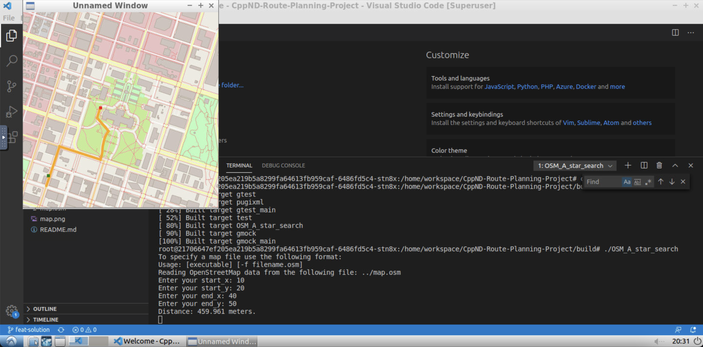
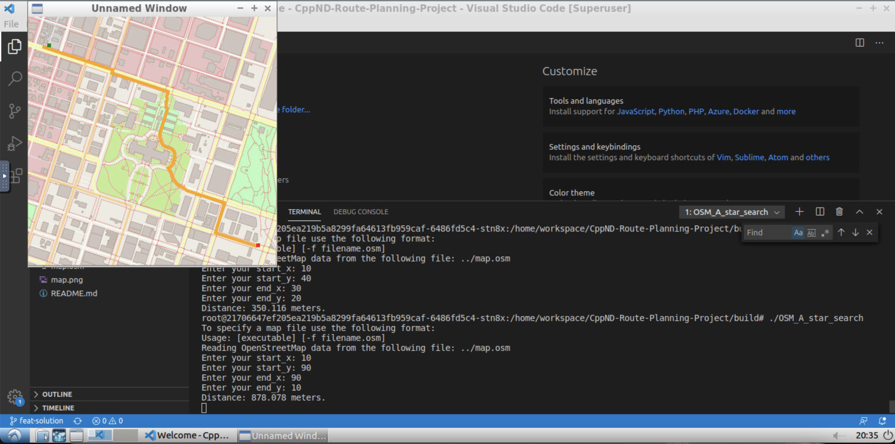

# Route Planning Project

This repo contains the starter code for the Route Planning project.


## Cloning

When cloning this project, be sure to use the `--recurse-submodules` flag. Using HTTPS:
```
git clone https://github.com/udacity/CppND-Route-Planning-Project.git --recurse-submodules
```
or with SSH:
```
git clone git@github.com:udacity/CppND-Route-Planning-Project.git --recurse-submodules
```

## Dependencies for Running Locally
* cmake >= 3.11.3
  * All OSes: [click here for installation instructions](https://cmake.org/install/)
* make >= 4.1 (Linux, Mac), 3.81 (Windows)
  * Linux: make is installed by default on most Linux distros
  * Mac: [install Xcode command line tools to get make](https://developer.apple.com/xcode/features/)
  * Windows: [Click here for installation instructions](http://gnuwin32.sourceforge.net/packages/make.htm)
* gcc/g++ >= 7.4.0
  * Linux: gcc / g++ is installed by default on most Linux distros
  * Mac: same instructions as make - [install Xcode command line tools](https://developer.apple.com/xcode/features/)
  * Windows: recommend using [MinGW](http://www.mingw.org/)
* IO2D
  * Installation instructions for all operating systems can be found [here](https://github.com/cpp-io2d/P0267_RefImpl/blob/master/BUILDING.md)
  * This library must be built in a place where CMake `find_package` will be able to find it
 

## Compiling and Running

### Compiling
To compile the project, first, create a `build` directory and change to that directory:
```
mkdir build && cd build
```
From within the `build` directory, then run `cmake` and `make` as follows:
```
cmake ..
make
```
### Running
The executable will be placed in the `build` directory. From within `build`, you can run the project as follows:
```
./OSM_A_star_search
```
Or to specify a map file:
```
./OSM_A_star_search -f ../<your_osm_file.osm>
```

## Testing

The testing executable is also placed in the `build` directory. From within `build`, you can run the unit tests as follows:
```
./test
```

## Troubleshooting
* Some students have reported issues in cmake to find io2d packages, make sure you have downloaded [this](https://github.com/cpp-io2d/P0267_RefImpl/blob/master/BUILDING.md#xcode-and-libc).
* For MAC Users cmake issues: Comment these lines from CMakeLists.txt under P0267_RefImpl
    ```
    if( NOT DEFINED IO2D_WITHOUT_SAMPLES )
	     add_subdirectory(P0267_RefImpl/Samples)
    endif()
    ```
    And then run "ALL_Build" and "install" in XCode.
    
    If any packages are missing try to install packages using 
    ```
    brew install pkg-config
    ```
 * For Ubuntu Linux IO2D installation errors, follow the given steps:
   ```
	sudo apt update
	sudo apt install build-essential
	sudo apt install cmake
	sudo apt install libcairo2-dev
	sudo apt install libgraphicsmagick1-dev
	sudo apt install libpng-dev

	git clone --recurse-submodules https://github.com/cpp-io2d/P0267_RefImpl
	cd P0267_RefImpl
	mkdir Debug
	cd Debug
	cmake --config Debug "-DCMAKE_BUILD_TYPE=Debug" ..
	cmake --build .
	sudo make install
   ```
     
 * If you are working on windows and unable to install IO2D:
      * Enable WSL (Windows Subsystem for Linux) and use a distribution like [Ubuntu](https://ubuntu.com/wsl).(available from the windows store): 
      * Install the required dependencies (compiler, cmake etc.) in the WSL(as mentioned above for ubuntu)
      * Configure CLion to use the WSL [toolchain](https://www.jetbrains.com/help/clion/how-to-use-wsl-development-environment-in-product.html#wsl-tooclhain)
      * Use the WSL toolchain to build the project
      * If you are still facing errors, visit this [link](https://github.com/udacity/CppND-Route-Planning-Project/issues/9).
     

* If you are facing errors with --config try to remove -- from the command.

## Project Rubric
### 1. Compiling and Testing
#### 1.1 The submission must compile.
Yes, it does.
#### 1.2 The submission must pass the final set of unit tests.
Yes, it does.
### 2. User Input
#### 2.1 The user should be able to provide inputs to the search.
Yes, it does.
#### 2.2 The user inputs should correspond with areas on the map.
Yes, it does.
### 3. Code Efficiency
#### 3.1 The methods in the code should avoid unnecessary calculations.
Yes, it does.

## Photos
### 1. From (10, 20) to (40, 50)

### 2. From (10, 90) to (90, 10)

### 3. From (40, 30) to (30, 10)
